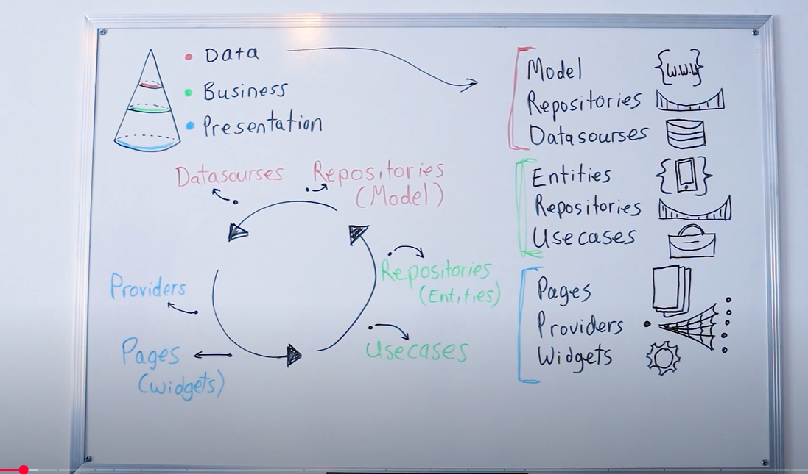
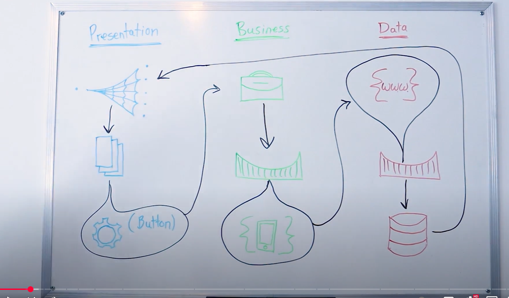
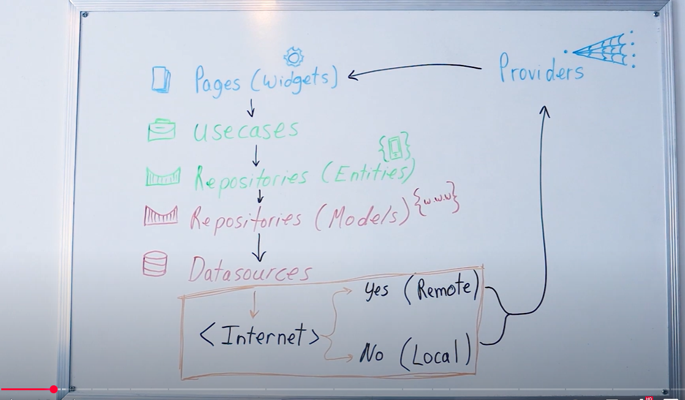
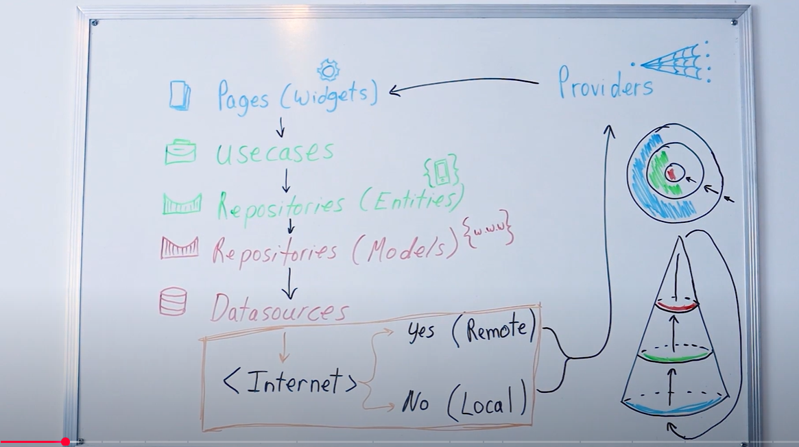

I’ll break it into:
```
What Entities really are (and what they’re not)

Where Entities live in the architecture

How they flow through your project

Common mistakes & misunderstandings

Best practices so you don’t trap yourself later

```

1️⃣ What Entities Really Are
In Clean Architecture, Entities are:

```
The core business objects of your application

Framework-agnostic (no Flutter widgets, no database annotations, no HTTP code)

Stable (rarely change even if you replace the UI, DB, or API)

```


***They’re used in:***

```
Use Cases (input/output types)

Repositories (contracts)

State classes (in presentation layer — but only passed through, not modified here)

Mapper conversions (from DTOs in data to Entities in domain)

```
*** images ***












3️⃣ How Entities Flow Through the Project

Here’s the life cycle of an entity in Clean Architecture:

[Data Layer]
API → Data Model (DTO) 
     ↕ (mapper)
[Domain Layer]
Entity (pure business object)
     ↕ (use case returns entity)
[Presentation Layer]
UI reads entity data → displays
Example flow:

User searches for products (UI triggers SearchProductsUseCase)

Use Case calls ProductRepository.searchProducts(query)

Repository returns Entities, not API models

UI (Bloc/ViewModel) receives Entities and builds widgets

4️⃣ Common Misunderstandings
❌ Mistake 1: Putting Entities in the Data Layer
If you put your entity next to your API model, you’ll end up tightly coupling them.
Then if the API changes, your whole app breaks.

❌ Mistake 2: Adding UI State into Entities
Entities are domain-only.
Bad:

dart
Copy
Edit
class Product {
  final String id;
  final String name;
  final bool isFavorite; // UI thing
}
Better:

dart
Copy
Edit
class Product { ... } // no UI stuff
class ProductUI {
  final Product product;
  final bool isFavorite;
}
❌ Mistake 3: Returning Raw API Models in Use Cases
If your usecase returns ProductModel from data/models,
you’ve leaked the data layer into your domain/presentation — bad for testability & maintainability.

5️⃣ Best Practices
✅ 1. Entities are shared safely across layers
Yes — you can use the same entity in:

Use Cases

Repositories

Bloc/ViewModels

Even widget parameters

Because they’re pure data, they won’t cause coupling problems.

✅ 2. Entities should outlive your current tech stack
If tomorrow:

You switch from REST → GraphQL

Or Hive → SQLite

Or Flutter → React Native

Your entities should stay the same.

✅ 3. Use mappers to protect them
Example mapper:

dart
Copy
Edit
extension ProductMapper on ProductModel {
  Product toEntity() {
    return Product(
      id: id,
      name: name,
      price: price,
      description: description,
    );
  }
}
Keeps entities clean

Decouples API structure from business rules

✅ 4. Use immutable entities
Make all fields final

Avoid setters

Changes → create a new entity instance

💡 In short:

Entities are the contract of your domain.

They can be used anywhere (use cases, repos, UI) but are owned by the domain layer.

Treat them like VIP guests: clean, untouched, and respected.

